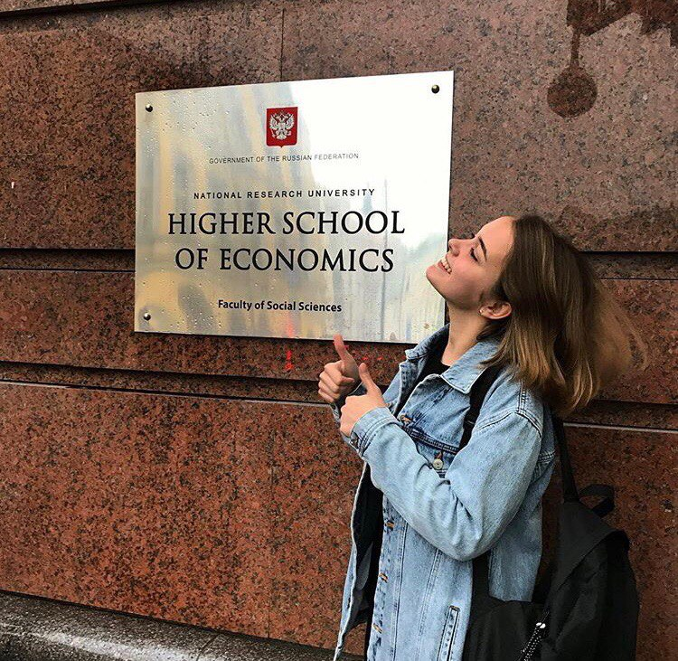
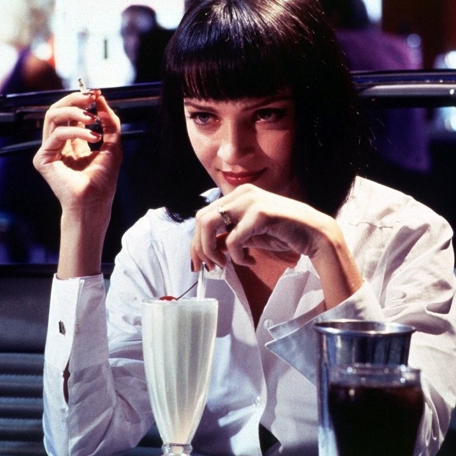
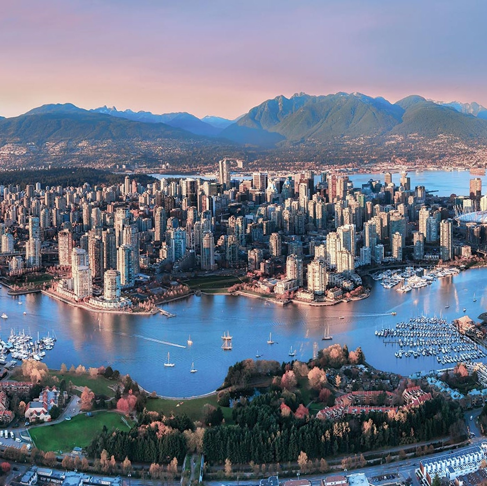

# hw1
Ниже будет мини-план моей *биографии* :)

## Кто же я?
- ФИ (можно же без О?)
- Как я оказалась в ВШЭ?
- Мои интересы/моя жизнь в целом
- Ссылки
***

# *Глава 1*
Всем здравствуйте! Меня зовут ~~Настюшка.~~ **Мельникова Анастасия**. 

Сегодня 20.01.18, а значит ровно через 4 месяца мне будет 19 лет. Я телец (♉), но должна была я родиться на 2 недели позже, т.е. отчасти я - нереализованные блезницы (♊). О своем детстве, наверное, здесь неуместно рассказывать, но я лишь хочу отметить, что оно у меня было великолепным благодаря **моим родителям и многочисленным родственникам**. Ну, а что выросло из того милого, невинного и всегда честного ребенка, то выросло. Итак, давайте же я вам скорее расскажу, почему я оказалась тут. 
***

# *Глава 2*
Это моя **саааамая** любимая история, ибо данным ВУЗом я загорелась еще в далеком 2015, когда только-только открылась моя (*уже и моя тоже, до сих пор не могу поверить*) ОП "ИЯиМКК". Пройдя на городской тур по ВСЕРОСу (англ.яз), я писала очередной этап олимпиады в здании на Мясницкой. Дабы развлечь школьников, которые ждали своей очереди на говорение, к нам в аудиторию позвали студентов новой программы ["ИЯиМКК"](https://www.hse.ru/ba/lang/) . Примерно 40 минут они *вкусно рассказывали* о сие нововведении в стенах ВШЭ. Ребята 100 раз почеркнули, что к ним на прорамму надо сдавать общагу (а не историю!), то есть ~~сам кто-то там с неба~~ сама судьба велела мне поступть сюда, ибо историю я не переваривала ни в каком виде, а она нужна во всех крутых гуманитарных ВУЗах. С того момента все и началось.  
В итоге, летом 2017 года, я, узнав свои прекрасные (скромно, но честно, ибо очень ими горжусь) результаты за ЕГЭ, побежала сдавать подлинник именно сюда. **Все**. Больше  я **никуда** и не подавала, потому что точно знала, что ничего меня больше не интересует. Так и завязалась моя любовь с самым крутым (по моему мнению) высшим учебным заведением в МСК ♡

***

# *Глава 3*
Тут можно написать целую книгу, так как я подросток с активно меняющимися приоритетами и интересами тоже. All in all, простараюсь вместить в список почти все, чем я живу и дышу :)  
P.S. порядок ≠ приоритет

1. Иностранные языки:
    * Английкий
    * Испанский
    * Немецкий
    * Хочу знать шведский! :(
2. Собачки (aaaaw).
3. Кино (пожалуйста, не приписывайте сюда сериалы!):
    * Триллеры
    * Детективы
    * Ужасы
    * Тарантино (♡)
   
4. Искусство:
    * Иллюстрации
    * Академическое искусство
    * Литература (читаю не часто, но читаю :) Обожаю **С. Кинга**)
    * Театр (спасибо, бабушка, что воспитала во мне любовь к театру)
    * Youtube (чем вам не искусство в современных реалиях?)
5. Учеба (да, я вечный ботан и перфекционист).
6. Банально, но... *путешествия* : 
Город моей мечты - Ванкувер.

Не знаю, что еще добавить, поэтому ловите мое расписание:

| Понедельник  | Вторник   | Среда  | Четверг | Пятница | 
| :----------- | :---------- | :---------- | :---------- | :---------- |
| Цифровая грамотность (лекция) | Испанский |  Латынь | Видео | Испанский |
| Цифровая грамотность (семинар)| Пупр | Пупр | Фонетика | ВКБ (лекция) |
| Ничего | Пупр | Испанский | Грамматика | Мкн (лекция) |
| Ничего | Мкн (семинар) | НИС | Грамматика | Ничего |
***

# *Глава 4*

- Туточки <https://vk.com/heystaas> находится мой вк (но там ничего интересного).
- Это мой [инст](https://www.instagram.com/nastyamilll/?hl=ru), где есть много меня.
- А здесь <https://www.youtube.com/channel/UCz-pon5ozZMUVUtK7TEZQTw> вы сможете посмотреть моего любимого блоггера!
***

                                'Спасибо за ваше терпение и за внимание! Приятно познакомиться :)'
